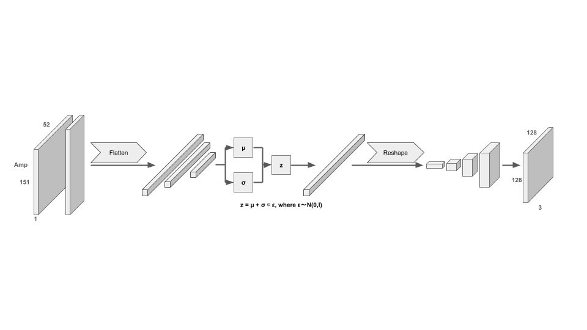

# CSI to Image Reconstruction

This project implements a system for reconstructing images from Channel State Information (CSI) using Wi-Fi signals. It consists of an embedded component (ESP32), a server for data collection and streaming (Python), and logic for model training.




## Project Structure

- **01_Embedded/**: ESP32 firmware code.
  - `01_cam/`: Camera module firmware (ESP32-CAM, ESP32-S3-CAM).
  - `02_csi/`: CSI collection firmware (TX, RX, Gateway).
- **02_Server/**: Backend server code.
  - `01_Data_Collection/`: Scripts for collecting CSI data.
  - `02_Streaming/`: Real-time streaming server using FastAPI and PyTorch.
- **03_Model_Training/**: Machine learning model training scripts.
  - `01_MoPoEVAE/`: Mixture-of-Product-of-Experts VAE implementation.
  - `02_VAE/`: Standard VAE implementation.
  - `03_Mesh/`: CSI-to-3D human mesh reconstruction.
- **04_Tools/**: Utility tools for development and configuration.
  - `SerialConfig/`: Web-based (Web Serial API) tool for dynamic IP/Port configuration.

## Configuration

- **Embedded**: Network settings (WiFi SSID/PWD, Server IP/Port) can be configured dynamically via the Web Serial Tool or UART.
- **Server**: Ensure the model checkpoint path is correct in `02_Server/02_Streaming/main.py`.

## Network Configuration

The Gateway and Camera modules allow real-time modification of Wi-Fi credentials (SSID/Password) and the target server address (IP/Port) without re-flashing the firmware. This configuration is stored in NVS (Non-Volatile Storage) and persists across reboots.

### How to Configure Network Settings

1.  Open `04_Tools/SerialConfig/index.html` in a Web Serial API supported browser (e.g., Chrome, Edge).
2.  Connect your device (Gateway or Camera) via USB (UART0).
3.  Click "Connect Device", select the COM port (115200 bps).
4.  Enter the desired Wi-Fi SSID, Password, Server IP, and Port.
5.  Click "Apply". The tool sends the configuration commands and saves them to NVS.
6.  Click "Reboot" to apply the new settings.

## Workflows

### 1. Data Collection & Training
Manage the full pipeline from raw signal gathering to model training.

1.  **Flash Firmware**: Build and flash the TX, RX, Gateway, and Camera firmware from `01_Embedded`.
2.  **Configure**: Use the Web Serial Tool to point all nodes to your server IP.
3.  **Collect Data**: Run the collection server to save synchronized CSI and image data.
    ```bash
    cd 02_Server/01_Data_Collection
    python main.py
    ```
4.  **Train Model**: Perform model training using the collected and aligned dataset. Training logic for different architectures is located in the `03_Model_Training` directory.

### 2. Real-time Streaming
Deploy the trained model for live image reconstruction.

1.  **Run Inference Server**: Execute the FastAPI server to process live CSI and serve the reconstructed images.
    ```bash
    cd 02_Server/02_Streaming
    uvicorn main:app --host 0.0.0.0 --port 8000
    ```
2.  **Visualize**: Open `http://localhost:8000` in your browser to see the real-time reconstruction.

## References

- **MoPoEVAE Implementation**: 
  - Based on the paper: [Strohmayer J., Sterzinger R., Stippel C. and Kampel M., “Through-Wall Imaging Based On WiFi Channel State Information](https://doi.org/10.1109/ICIP51287.2024.10647775).
  - Original Code: [StrohmayerJ/wificam](https://github.com/StrohmayerJ/wificam)


